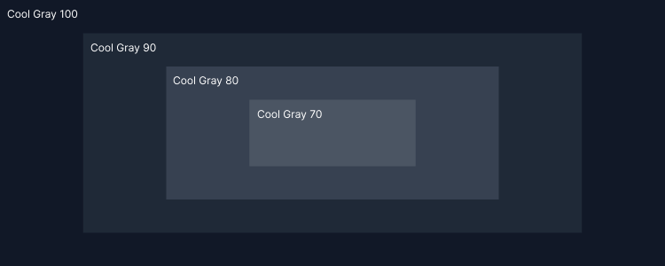
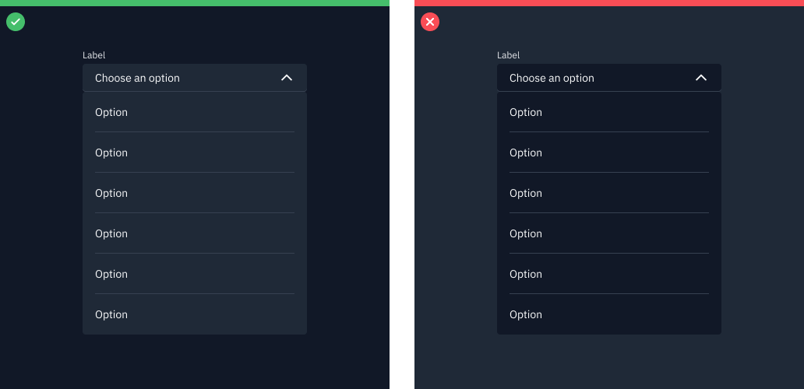

# Color

## Color anatomy

Unburn’s default themes are derived from the fire color palette. The cool gray family is dominant in the default themes, making use of subtle shifts in value to organize content into distinct zones

The core orange family serves as the primary action color across all products and experiences. Additional colors are used sparingly and purposefully.

<figure><figcaption></figcaption></figure>

###

## Layering model

Colors in the cool gray palette are layered on top of each other to create depth and spatial associations. The layering model defines the logic of how colors stack on top of each other in a UI when using the Carbon themes. Aspects of the layering model are built directly into the themes, color tokens, and components.

In the dark themes, layers become one step lighter with each added layer.

<figure><figcaption></figcaption></figure>

### &#x20;

## Implementing color 

Unburn uses tokens and themes to manage color. Tokens are role-based, and themes specify the UI's color values that serve those roles.

| Term    | Definition                                                                                                                                                                    |
| ------- | ----------------------------------------------------------------------------------------------------------------------------------------------------------------------------- |
| _Theme_ | A theme is a collection of colors designed to create a specific aesthetic. Themes control the color value assigned to a token. For example, the Cool gray 100 theme.          |
| _Token_ | A token is a role-based identifier that assigns a color. Unlike hex codes, tokens apply universally across themes. For example, `$layer`, `$border-subtle`, `$support-error`. |
| _Role_  | A role is the systematic usage of a color assigned to a token. Roles cannot be changed between themes.                                                                        |
| _Value_ | A value is the unique visual attribute (hex code, RGBA value) assigned to a token through the use of themes.                                                                  |

###

## Theme

Themes serve as an organizational framework for color in Unburn, with a theme based on a specific primary background color. And get their names from their background color.

#### Global Background colors

| Theme    | Primary background     | Token         | Hex value |
| -------- | ---------------------- | ------------- | --------- |
| Gray 100 | Global Background Dark | `$background` | `#111827` |

#### **Layering model**

In the dark themes, layers become one step lighter with each added layer.

<figure><figcaption>
Gray 90 dropdown on Gray 100 background. Do not apply components that are darker than the background.
</figcaption></figure>

###

## Tokens

Tokens are methods of applying color in a consistent, reusable, and scalable way. They help us abstract how we use color from the values themselves. They are used in place of hard-coded values, like hex codes. Tokens allow for value changes to be made at scale, making design language changes easy to implement, as well as making possible color functionalities like inline theming and light or dark mode.

Each token is assigned a role and a value. The role determines what element to apply a token too and the value is the actual color (hex code) that appears in the assigned theme. Color token names and roles are the same across themes, only the assigned value will change with the theme. For example, under the hood, the `$text-secondary` token can dynamically map to `Gray 70` or `Gray 30` depending on the theme.

See the [color usage](foundation/color/usage.md) tab for the full list of color tokens.

###

### Token names

For quick reference, the role of a token is represented in the token name itself to help you correctly apply tokens. The first part of the token name references the general UI element the color is being applied to, like `background`, `text`, or `border`. The second part of a token name will specify its unique role within the element group like `$border-subtle` or `$text-primary`. Additionally, some tokens include an interaction state at the end, like `$background-hover`.

<figure><figcaption></figcaption></figure>

###

### Color tokens

Color tokens that can be applied across components are called _core tokens_. There are ten main groups of core color tokens. They are grouped by the common UI element that they are applied to. Token groups make it easier to find and apply color tokens. Interaction state tokens are included in the group alongside their enabled state tokens. There are a few core tokens that do not belong to the group and stand as individual tokens like `$overlay`, `$highlight`, and `$interactive`.
